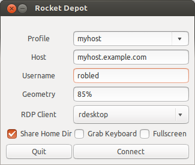

#### Rocket Depot

Rocket Depot is a simple graphical frontend for rdesktop and FreeRDP with
support for connection profiles.  It runs on Linux desktops using GTK3 and
takes advantage of modern desktop environment features such as Unity
Quicklists.

#### Installation

##### Ubuntu PPA

    sudo apt-add-repository ppa:robled/rocket-depot
    sudo apt-get update
    sudo apt-get install rocket-depot
    
##### PyPI
    sudo pip install rocket-depot
    
#### Supported RDP Clients

Rocket Depot supports rdesktop and FreeRDP.  The Ubuntu package depends on rdesktop.  If you'd like to use FreeRDP, be aware that only the [new command-line interface](https://github.com/FreeRDP/FreeRDP/wiki/CommandLineInterface) is supported at this time.  To ensure compatibility, the [FreeRDP PPA](https://launchpad.net/~freerdp-team/+archive/freerdp) is recommended if running Ubuntu, otherwise make sure your FreeRDP version is 1.0.1 or better.  
